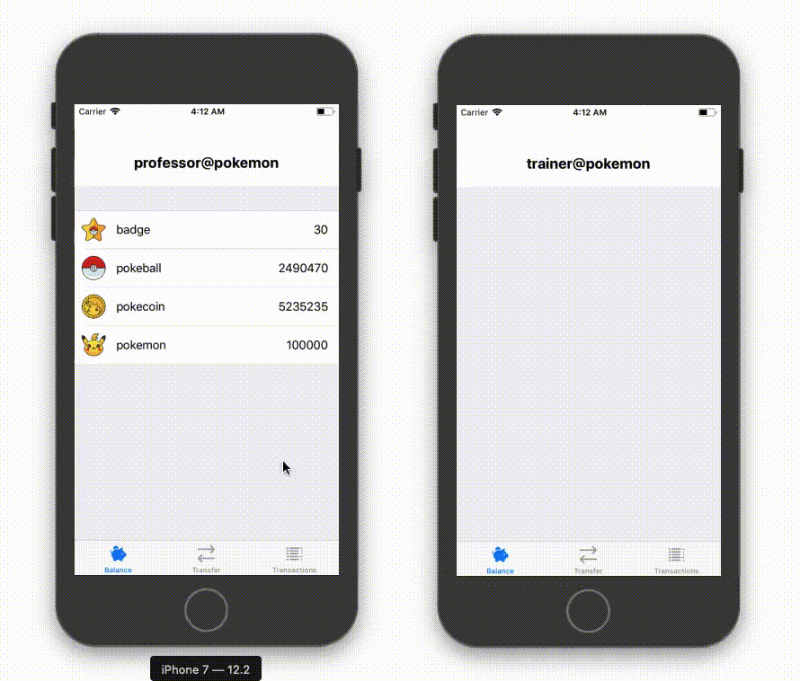

# Iroha

Simple Iroha app with iOS client.  
This example was created for the `Basics of Grid and Cloud Computing course`.

## How to launch
  1. Clone this repo
  2. Run `bash deploy.sh`
  3. Run Iroha daemon: `irohad --config config.docker --genesis_block genesis.block --keypair_name node0 --overwrite_ledger`
  4. Open new terminal
  5. Install dependencies for iOS app: `pod install`
  6. Run `.xed`to open Xcode workspace
  7. Launch app: **⌘R**
  8. Login with *account_id* (and *public/private key* if you created a new account)

## How it works

